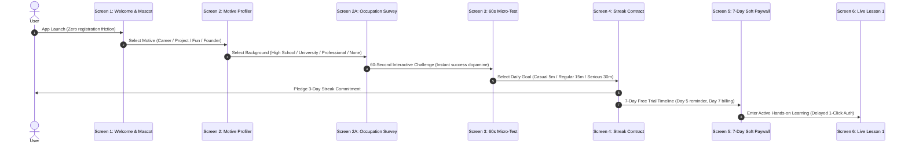
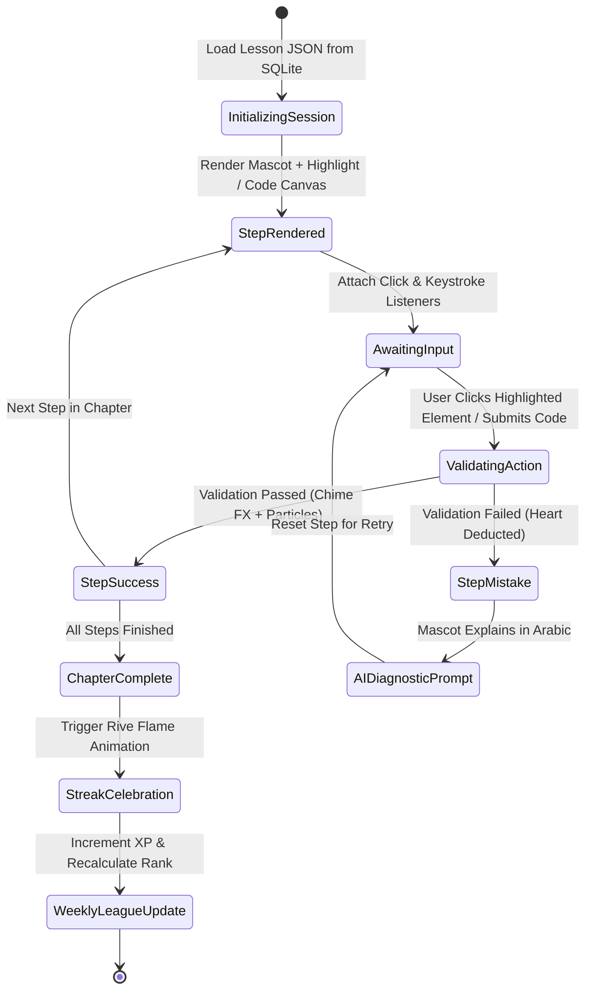

# Mimo & Duolingo Design System & Architecture Skill

Production-ready technical specifications, design tokens, UI recipes, and system architecture blueprints derived directly from reverse-engineering the APK binaries of **Mimo** (`com.getmimo`, v3.62 & v6.18) and **Duolingo** (`com.duolingo`, v5.65 & v6.19).

---

## 1. UI Design System & Component Engineering

### 1.1 Tactile 3D "Lip" Button Physics (Duolingo `JuicyButton` Pattern)
Duolingo implements mechanical 3D physical buttons via custom view subclasses (`com.duolingo.core.design.juicy.ui.*`). The visual button consists of a **Face Layer** (`buttonFaceColor`) and a **4px Bottom Lip** (`buttonLipColor`).

```css
/* Production Tactile 3D Button (Bataa Juicy Theme) */
.bataa-btn-tactile {
  --btn-face: #ff7a00;       /* Face color */
  --btn-lip: #d45900;        /* 4px bottom lip */
  --btn-text: #ffffff;
  
  position: relative;
  display: inline-flex;
  align-items: center;
  justify-content: center;
  font-family: inherit;
  font-weight: 700;
  font-size: 17px;
  letter-spacing: 0.5px;
  text-transform: uppercase;
  color: var(--btn-text);
  background-color: var(--btn-face);
  border: none;
  border-radius: 16px;
  padding: 14px 24px;
  box-shadow: 0 4px 0 0 var(--btn-lip);
  cursor: pointer;
  transform: translateY(0);
  transition: transform 0.08s ease, box-shadow 0.08s ease, filter 0.12s ease;
  user-select: none;
  touch-action: manipulation;
}

.bataa-btn-tactile:hover {
  filter: brightness(1.04);
}

.bataa-btn-tactile:active {
  transform: translateY(4px);
  box-shadow: 0 0 0 0 var(--btn-lip);
}

/* Green Success Variant (juicyOwl / juicyTreeFrog) */
.bataa-btn-success {
  --btn-face: #58cc02;
  --btn-lip: #58a700;
}

/* Purple Developer Studio Variant (Mimo Studio) */
.bataa-btn-purple {
  --btn-face: #7e4bde;
  --btn-lip: #5a2bb8;
}

/* Secondary White Card Variant (juicySnow / juicySwan) */
.bataa-btn-secondary {
  --btn-face: #ffffff;
  --btn-lip: #d1d1d1;
  --btn-text: #4b4b4b;
  border: 2px solid #e5e5e5;
  box-shadow: 0 4px 0 0 #d1d1d1;
}
.bataa-btn-secondary:active {
  transform: translateY(4px);
  box-shadow: 0 0 0 0 #d1d1d1;
}
```

### 1.2 Interactive Animation Engine: Rive vs Lottie
- **Mimo 2024 Architecture**: Switched from heavy video/Lottie assets to **Rive Runtime** (`app.rive.runtime.kotlin.RiveAnimationView`, `hearts.riv`, `streak.riv`). Rive delivers 60fps vector state machines with under 50KB asset footprints.
- **Duolingo 2024 Architecture**: Uses multi-layered VectorDrawables (`.xml` to `__5.xml`) and Lottie JSONs for particle effects (`view_perfect_lesson_sparkles.xml`).

---

## 2. Onboarding Funnel Architecture (Reverse-Engineered Schema)



### 2.1 Motive & Occupation Taxonomy (Mimo 2024 Binary Extraction)
- **Motive Taxonomy**:
  - `btn_motive_career`: "Become a professional software engineer / 3D artist"
  - `btn_motive_project`: "Build my own app, game, or startup idea"
  - `btn_motive_developer`: "Level up skills for my current developer job"
  - `btn_motive_fun`: "Learn digital creation as a creative hobby"
- **Occupation Taxonomy**:
  - `btn_occupation_high_school`, `btn_occupation_university`, `btn_occupation_professional`, `btn_occupation_self_employed`, `btn_occupation_none`.

---

## 3. Interactive Learning Engine (MVI State Machine)



---

## 4. Gamification & Retention Mechanics

1. **Streak Economy & Streak Society**:
   - Visual flame counter in navigation header.
   - Milestone unlocks at 3, 7, 14, 30, 50, 100, 365 days.
   - **Streak Freeze** item acts as an insurance policy against missed days.
   - **Friend Streaks** (Duolingo 2024): Shared accountability pairs where missing a day affects both friends.
2. **Weekly League Cohorts (10 Divisions)**:
   - Bronze, Silver, Gold, Sapphire, Ruby, Emerald, Amethyst, Pearl, Obsidian, Diamond.
   - 30 learners per weekly cohort. Top 7 promote, bottom 5 demote every Sunday at 23:59 UTC.
3. **Hearts & Practice Economics**:
   - 5 maximum hearts. 1 mistake = 1 heart lost.
   - Free learners refill hearts through **Practice Review Mode** (monetization pressure balanced with continuous learning).

---

## 5. Application to Bataa (`bataa.app`)

| Domain | Mimo / Duolingo Reverse-Engineered Standard | Bataa Desktop AI Tutor Implementation |
| :--- | :--- | :--- |
| **Mascot Interaction** | Duo emotional states + Mimo AI Tutor | **Bataa Duck**: Sits on desktop screen, speaks conversational Arabic, places glowing yellow boxes (`#ffd600`) over native software (Blender, VS Code). |
| **UI Design System** | Tactile 3D Juicy Buttons (`#ff7a00` / `#d45900`) | Warm Cream background (`#fff6e9`), 3D tactile buttons, dark developer code studio (`#2f314f`). |
| **Onboarding** | Motive profiling + Streak contract before paywall | Select skill path -> 60s hands-on highlight test -> 3-day streak pledge -> 1-click Google auth. |
| **Error Handling** | Duolingo Max Explain My Answer | Adaptive real-time error explanation in natural Arabic when user clicks wrong button in Blender. |
