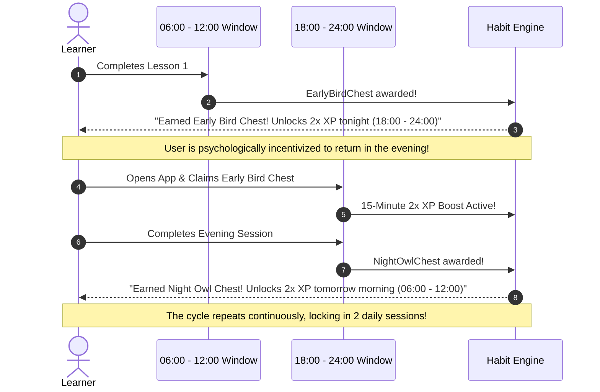

# Daily Habits, Retention Algorithms & Psychological Mechanics

This document provides the complete theoretical foundation and algorithmic formulas reverse-engineered from Duolingo and Mimo.

---

## 1. The Interlocking Diurnal Chest Loop (Morning <-> Night Hook)

---

## 2. Spaced Repetition: Half-Life Regression (HLR)

The memory recall probability $p$ is calculated as:
$$p = 2^{-\frac{\Delta t}{h}}$$

Where:
- $\Delta t$ is the elapsed time in hours since the last review.
- $h$ is the estimated memory half-life in hours.

### Half-Life Update Rules:
1. **On Correct Answer**:
   $$h_{\text{new}} = h_{\text{old}} \times (1.8 + 0.8 \times \text{accuracyRate})$$
2. **On Mistake / Incorrect Answer**:
   $$h_{\text{new}} = \max(0.5, h_{\text{old}} \times 0.45)$$

---

## 3. The 4-Stage Daily Notification Escalation Funnel

When a user has not practiced today, notifications trigger along an escalating curve:

1. **Stage 1 (Personalized Median Hour, e.g. 14:00)**: *Curiosity & Opportunity*
   - Copy: *"🦆 بطة تنتظرك في بلندر! 5 دقائق فقط لتعلم مهارة جديدة."*
2. **Stage 2 (18:30)**: *Streak Preservation Warning*
   - Copy: *"🔥 حماسك في خطر! حافظ على سلسلة الـ 14 يوماً بتمرين واحد سريع."*
3. **Stage 3 (21:45)**: *Mascot Emotion & Loss Aversion*
   - Copy: *"⚠️ بطة حزينة... باقٍ ساعتان فقط قبل تجميد سلسلتك!"*
4. **Stage 4 (23:15)**: *Emergency Countdown*
   - Copy: *"🚨 45 دقيقة متبقية لإنقاذ السلسلة قبل منتصف الليل!"*

---

## 4. Friend Streaks: The Social Accountability Multiplier

In Duolingo 2024, Friend Streaks require **both users** in a pair to complete a lesson every single day:
- If User A completes, User B receives a native push: *"A real friend honors their Friend Streak — Complete your lesson to save your streak with [Friend]!"*
- Leverages social commitment to transform solo retention into network retention.
