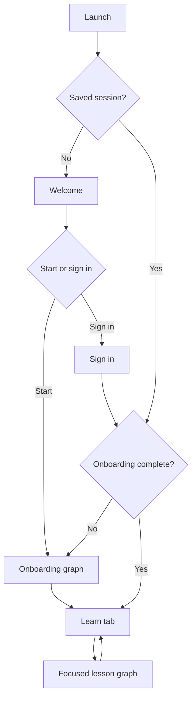
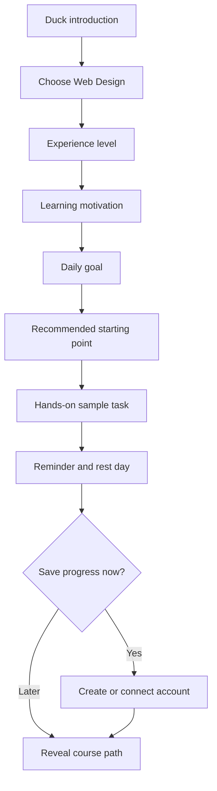
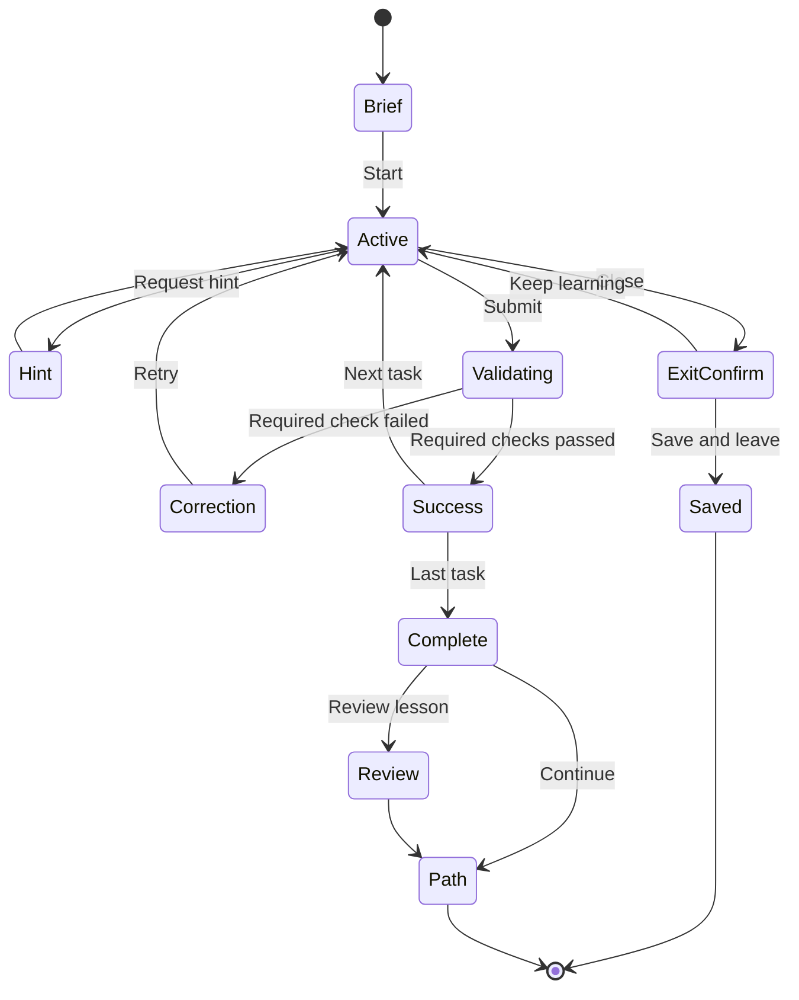

# Mobile UI Components and Navigation Graphs

Use this guide to decide which screen owns an interaction, how flows connect, and what happens when a learner enters, exits, resumes, or follows a deep link. It translates the Behance case study's mobile patterns into Bataa; it is not a copy of Duolingo's Android XML.

## Navigation layers

Keep four layers distinct:

1. **Entry stack:** splash, welcome, sign-in, and account recovery.
2. **Onboarding stack:** one-decision screens followed by the first course-path reveal.
3. **Authenticated tabs:** Learn, Practice, Projects, and Profile; omit a tab until it has useful content.
4. **Focused learning stack:** lesson brief, tasks, feedback, completion, and review. Hide global tabs here.

Do not place lesson submission inside global navigation. Do not show the full tab bar during a focused lesson.

## Root graph



Resolve session and onboarding state before rendering a destination. Avoid flashing the wrong route while authorization loads.

## Onboarding graph



- Keep acquisition-source questions optional and skippable.
- Preserve prior answers when navigating back.
- Persist every accepted step locally.
- Let the learner override the recommended starting point.
- Do not place a paywall before the learner understands the learning experience and billing terms.

## Authenticated tab graph

```text
AppShell
├── Learn
│   ├── Course path
│   ├── Unit details
│   └── Lesson entry
├── Practice
│   ├── Due review
│   ├── Mistake history
│   └── Practice session
├── Projects
│   ├── Project list
│   └── Project detail / preview
└── Profile
    ├── Learning goal
    ├── Reminder and rest day
    ├── Language and accessibility
    └── Account and privacy
```

Keep visible text labels on every tab. Mark the active route using icon, label weight, and semantic current-page state, not color alone.

## Focused lesson graph



Never send a mistake to a terminal failure route. Completion and review are separate destinations because they serve different cognitive purposes.

## Screen-to-component map

| Screen or region | Required components | Key behavior |
| --- | --- | --- |
| Welcome | `MascotDialogue`, value statement, `TactileButton`, sign-in link | One obvious start action. |
| Onboarding question | `FlowHeader`, `ChoiceCardGroup`, `StickyActionBar` | Continue stays disabled until valid. |
| Course path | `UnitHeader`, `CoursePathNode`, daily progress summary, labeled tabs | Next lesson has the strongest emphasis. |
| Lesson brief | objective, estimated time, concept preview, start button | State the real output the learner will build. |
| Lesson task | `LessonHeader`, instruction, task renderer, preview, sticky submit | Keep global tabs hidden. |
| Correction | `FeedbackSheet`, code/preview target, retry button | Preserve work and explain why. |
| Completion | artifact preview, capability statement, progress, continue/review | Reward skill before XP. |
| Review | concept recap, mistake cards, transfer task | Strengthen understanding, not activity count. |

Use `component_system.md` for the detailed appearance and interaction states of these components.

## Shared component contracts

```ts
type LocalizedText = { ar: string; en: string }

interface FlowHeaderProps {
  current: number
  total: number
  onBack?: () => void
  onClose?: () => void
}

interface ChoiceOption {
  id: string
  label: LocalizedText
  description?: LocalizedText
  icon?: string
  disabled?: boolean
}

interface CoursePathNodeProps {
  lessonId: string
  title: LocalizedText
  state: 'locked' | 'available' | 'in-progress' | 'completed' | 'mastered'
  estimatedMinutes?: number
  prerequisiteLabel?: LocalizedText
}

interface StickyActionBarProps {
  primaryLabel: LocalizedText
  primaryDisabled?: boolean
  primaryBusy?: boolean
  feedbackRegionId?: string
}
```

Use semantic events such as `lessonStarted` or `answerSubmitted`; do not make parent screens depend on visual animation names.

## Route guards

- Redirect authenticated learners away from welcome without destroying a requested deep link.
- Redirect incomplete onboarding to the last saved onboarding step.
- Allow completed lessons to open in replay mode.
- Explain locked lessons instead of silently returning to the path.
- Validate course and lesson IDs before rendering.
- Route missing or retired content to a recoverable course-path state.
- Preserve locale in every redirect.

## Back, close, and interruption behavior

- **Onboarding back:** return to the prior decision with the answer preserved.
- **Lesson back/close:** show a short save-and-leave confirmation only when unsaved work exists.
- **System back:** follow the same behavior as the visible control.
- **App backgrounding:** save the active draft and task index.
- **Resume:** restore the task, draft, feedback state when useful, and remaining lesson progress.
- **Completion back:** return to the path; never reopen the last task as incomplete.

Avoid trapping the learner to protect a streak or reward animation.

## Deep-link rules

Support stable links to courses, lessons, projects, glossary entries, and settings. A deep link to a lesson must:

1. Resolve authentication without losing the destination.
2. Verify enrollment and prerequisites.
3. Show a clear locked explanation when necessary.
4. Start at the brief for a new lesson or offer resume for an active lesson.
5. Return to the correct course path after completion.

## RTL and mobile layout

- Use logical start/end positioning throughout navigation.
- Mirror back/forward arrows in Arabic; keep code and media controls in their standard direction.
- Mirror path curves only if their reading order depends on direction.
- Keep code editors and code-specific gestures LTR.
- Respect top, bottom, and keyboard safe areas.
- Test the graphs at 360 x 800 and 390 x 844 CSS pixels with large text.

## Navigation acceptance checks

- A new learner can identify every main destination without memorizing icons.
- A learner can leave and resume any active lesson without losing work.
- No route bypasses onboarding or lesson prerequisites accidentally.
- A mistake never ejects the learner from the lesson.
- A locked or missing destination always explains recovery.
- Arabic and English follow equivalent routes with correct directionality.
